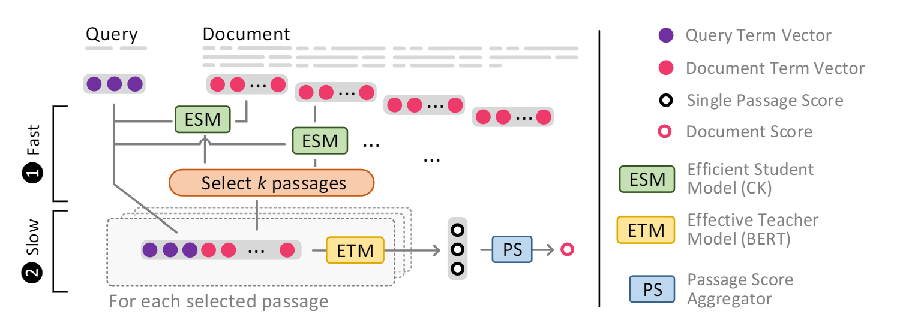

# Intra-Document Cascading (IDCM): Learning to Select Passages for Neural Document Ranking

Welcome 🙌 to the repository of our paper:

*Intra-Document Cascading: Learning to Select Passages for Neural Document Ranking* 
Sebastian Hofstätter, Bhaskar Mitra, Hamed Zamani, Nick Craswell, Allan Hanbury; In Proc. of 
SIGIR 2021

https://arxiv.org/abs/2105.09816

**tl;dr** To make long document re-ranking more efficient, we propose an intra-document cascading strategy, which prunes passages of a candidate document using a less expensive model, called ESM, before running a scoring model that
is more expensive and effective, called ETM. We found it best to
train ESM (short for Efficient Student Model) via knowledge distillation from the ETM (short for Effective Teacher Model) e.g., BERT.
This pruning allows us to only run the ETM model on a smaller
set of passages whose size does not vary by document length, reducing the overall latency.

If you have any questions, suggestions, or want to collaborate please don't hesitate to get in contact with us via [Twitter](https://twitter.com/s_hofstaetter) or mail to s.hofstaetter@tuwien.ac.at


*The IDCM architecture, with ESM & ETM sub-modules working together*

**Please cite our work as:**
````
@inproceedings{Hofstaetter2021_idcm,
 author = {Sebastian Hofst{\"a}tter and Bhaskar Mitra and Hamed Zamani and Nick Craswell and Allan Hanbury},
 title = {{Intra-Document Cascading: Learning to Select Passages for Neural Document Ranking}},
 booktitle = {Proc. of SIGIR},
 year = {2021},
}
````
## Trained Models

We provide the following full-trained DistilBERT-based IDCM model (cascading 4x 64 token windows per document) via the HuggingFace model hub:

* **IDCM** (re-ranking model): https://huggingface.co/sebastian-hofstaetter/idcm-distilbert-msmarco_doc

    For a minimal usage example of the IDCM model check out our notebook [minimal_idcm_usage_example.ipynb](minimal_idcm_usage_example.ipynb) here or [](https://colab.research.google.com/github/sebastian-hofstaetter/intra-document-cascade/blob/master/minimal_idcm_usage_example.ipynb)

## Source Code

The full source-code for our paper is here, as part of our matchmaker library: https://github.com/sebastian-hofstaetter/matchmaker

We have getting started guides for training teachers & students, as well as a range of other possibilities for neural re-ranking training.
